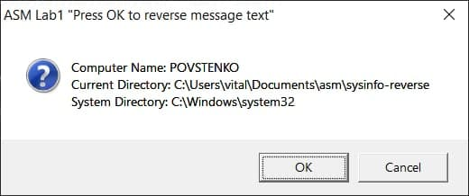
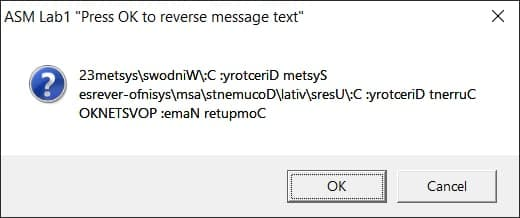

# sysinfo-reverse
Show system information and string revers on Assembly

Combine the results of **GetComputerName**, **GetCurrentDirectory**, **GetSystemDirectory** into one string. Display in the **MessageBox** window. At the same time display 2 buttons, *"OK"* and *"Cancel"*. If you press *"OK"*, re-print the string in reverse, if you can *"Cancel"*, exit the program.

